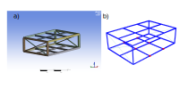
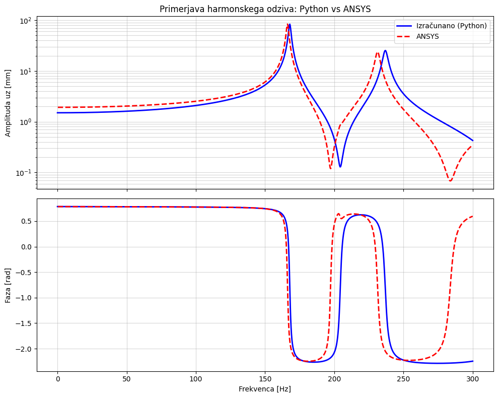
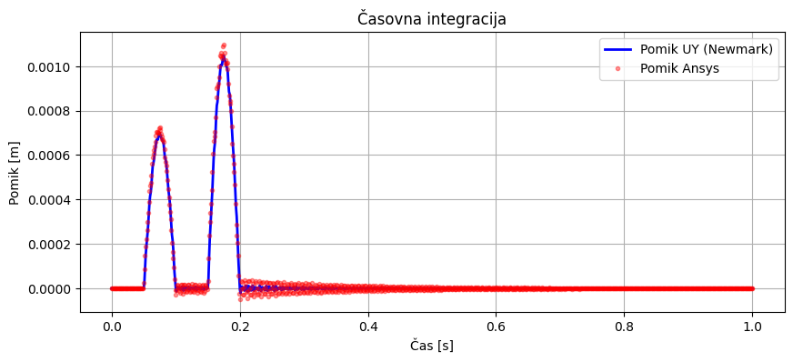

# 3D Structural Dynamics Solver (MKE)

Prostorski (3D) reševalnik po metodi končnih elementov (MKE) za dinamsko analizo linijskih konstrukcij, razvit v okviru predmeta Dinamika strojev in konstrukcij (DSKM) na Fakulteti za strojništvo Univerze v Ljubljani. Program arhitekturno ločuje definicijo makro-geometrije, mreženje, predpisovanje robnih pogojev in numerično reševanje.

---

## Glavne funkcionalnosti

* **Hibridni končni elementi:** Hkratna obravnava 3D nosilcev (Euler-Bernoulli, 12 DOF) s polno upogibno in torzijsko togostjo ter 3D palic (Truss, 6 DOF) za osne obremenitve. Orientacija asimetričnih prerezov je nadzorovana z referenčnim vektorjem `v_up`.
* **Vektorizirano sestavljanje matrik:** Generacija lokalnih matrik in prehod v globalni koordinatni sistem z uporabo tenzorskega množenja (`numpy.einsum`) in `scipy.sparse.coo_matrix` za superpozicijo, s čimer se solver izogne uporabi `for` zank preko elementov.
* **Metoda ničelnega prostora (Null Space):** Robni pogoji so uveljavljeni z eksaktno matematično redukcijo sistema prek projekcijske matrike $\mathbf{L}$.
* **Harmonska analiza s kompleksnimi silami:** Modalna superpozicija v kompleksni domeni omogoča hkratno obravnavo več vzbujanj z različnimi faznimi zamiki ($F \cdot e^{i\phi}$). Rayleighova matrika dušenja se pri tem diagonalizira.
* **Časovna integracija:** Implementirana je direktna integracija z Newmark-$\beta$ metodo (metoda povprečnega pospeška). Za povečanje računske učinkovitosti se uporablja predfaktorizacija (LU dekompozicija) efektivne togostne matrike pred vstopom v časovno zanko.
* **3D Vizualizacija:** Prikaz makro-geometrije in MKE mreže (PyVista) ter 3D animacije modalnih oblik, harmonskega odziva in tranzientnega nihanja (Open3D).

---

## Arhitektura modulov

Koda je razdeljena v samostojne module za zagotavljanje preglednosti:

1. `geometry.py` - Definicija materialov, prerezov in makro-geometrije (`Part`) s ključnimi točkami in linijami.
2. `meshing.py` - Avtomatski generator MKE mreže z ločeno diskretizacijo za nosilce in palice.
3. `bound_cond.py` - Definiranje enačb vezi in generacija projekcijske $\mathbf{L}$ matrike.
4. `load.py` - Generacija vektorjev in matrik za statične, kompleksne in časovno-odvisne obremenitve.
5. `solver.py` - Zaledje za MKE matematiko: sestavljanje matrik in izvajanje analiz (`solve_eigen`, `solve_harmonic_superposition`, `solve_integration_newmark_fixed`).
6. `postprocessing.py` - Izris FRF diagramov, vizualizacija konstrukcije in 3D animacije odzivov.

---

## Validacija modela (Python vs. ANSYS)

Reševalnik je bil preverjen s primerjavo rezultatov komercialnega paketa **ANSYS (BEAM188 / LINK180)** na modelu prostorske konstrukcije:
* **Modalna analiza:** Povprečno absolutno odstopanje prvih 30 lastnih frekvenc znaša približno 4 %, napaka pri prvi lastni obliki pa je pod 1 %. Pojasnjena odstopanja pri višjih oblikah izhajajo iz razlik med privzeto Euler-Bernoullijevo teorijo v Pythonu in Timoshenkovo teorijo v ANSYS-u.
* **Harmonska analiza:** Amplitudni in fazni spekter prenosne funkcije (FRF) potrjujeta pravilno implementacijo dušenja in upoštevanje faznih zamikov v kompleksni domeni.
* **Časovna integracija:** Ujemanje amplitud pri simulaciji zaporednih udarnih impulzov. Zaradi odsotnosti iteracij za preverjanje ravnotežja, rekonstrukcije napetosti in pisanja rezultatov na disk, je bil izračun v Pythonu (24.2 s) zaključen hitreje od ekvivalentnega izračuna v ANSYS-u (85.0 s).

---

## Namestitev in uporaba

### Odvisnosti
Za zagon kode je priporočen Python 3.8+ in naslednje knjižnice:
```bash
pip install numpy scipy matplotlib pyvista open3d pandas
```

### Kratek primer uporabe
Analize se običajno poganjajo preko Jupyter zvezka (`.ipynb`):

```python
from geometry import Material, Section, Part
from meshing import Mesh
from bound_cond import DOFManager
from load import LoadManager
from solver import GlobalAssembly, Solvers
from postprocessing import Visualizer

# 1. Definicija materiala in geometrije
alu = Material(name="Alu", E=68.9e9, G=26e9, rho=2700, alpha=1e-4, beta=1e-5)
profil = Section(name="I_profil", A=62e-6, Iy=340e-12, Iz=1925e-12, It=88e-12, Ip=2265e-12)

p = Part()
n1 = p.add_keynode([0, 0, 0])
n2 = p.add_keynode([0, 0, 1])
p.assign_property([p.add_line(n1, n2)], material=alu, section=profil, elem_type="Frame3D", v_up=[0, 1, 0])

# 2. Mreženje in robni pogoji
mesh = Mesh()
mesh.generate_mesh(p, global_size=0.1)

dm = DOFManager(mesh)
dm.fix_all(node_id=0)

# 3. Analiza
assembly = GlobalAssembly(mesh, dm)
K, M, C = assembly.assemble_matrices()
solver = Solvers(K, M, C, dm)

# Modalna analiza in vizualizacija
eig_vals, eig_vecs = solver.solve_eigen()
vis = Visualizer(mesh, dm)
vis.print_frequency_table(eig_vals)
vis.animate_mode_shape(eig_vals, eig_vecs, mode_idx=0)
```

---


## Tehnično poročilo in matematično ozadje

Repozitoriju je priloženo tehnično poročilo, ki služi kot podrobna dokumentacija razvitega programa in primer njegove praktične uporabe na realnem inženirskem problemu. 

📄 **[Tehnično poročilo - Dinamika prostorskih konstrukcij (PDF)](porocilo/porocilo.pdf)**

V poročilu so podrobneje opisani naslednji sklopi:
* **Teoretične izpeljave:** Zapis uporabljenih lokalnih matrik za elemente (Euler-Bernoulli nosilcev, palic) in matematični postopek globalne transformacije z uporabo smernih cosinusov.
* **Struktura solverja:** Opis vektoriziranega sestavljanja globalnih matrik (`numpy.einsum`, format COO) in matematične uveljavitve robnih pogojev prek projekcijske matrike ničelnega prostora.
* **Analiza primera (GomSpace 6U):** Prikaz celotnega poteka analize na primeru mešane prostorske konstrukcije. Poročilo vsebuje kvantitativno primerjavo vseh treh dinamičnih analiz z rezultati programa ANSYS ter analitično razlago opazovanih odstopanj med reševalnikoma.

---

## Interaktivni primer (Jupyter Notebook)

Za lažji začetek uporabe knjižnice je repozitoriju priložen popolnoma delujoč interaktiven zvezek. V njem je prikazano reševanje 3D konstrukcije, uporaba solverjev, izris vseh zgornjih grafov in prikaz Open3D animacij:

📓 **[Interaktivni primer - seminar_1.ipynb](seminar_1.ipynb)**

Zvezek omogoča hitro preizkušanje različnih robnih pogojev in vzbujanj. Priporočamo, da knjižnico najprej preizkusite preko tega zvezka!

---


## Galerija rezultatov

Spodaj so prikazane nekatere zmožnosti vizualizacije `DSKM` modula: generacijo končnih elementov, računanje harmonskega odziva ter izris modalnih oblik in časovne integracije. Več animacij je na voljo v mapi `videos`.

**Diskretizacija 3D konstrukcije (Mreženje)**


**Modalna analiza: Prva lastna oblika (Animacija Open3D)**


**Harmonska analiza: Frekvenčno odzivna funkcija (FRF)**


**Časovna integracija: Serija impulzov (Newmark-beta)**


**Časovna integracija: Animacija odziva konstrukcije**
